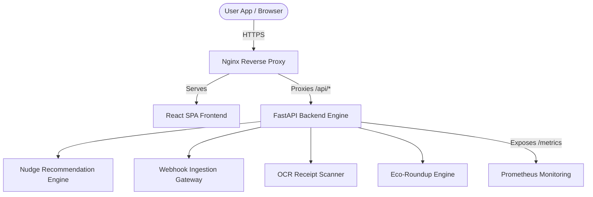

# 🌍 EcoStep: Real-time Carbon Accounting, Nudges & Fintech Offsets

EcoStep is an enterprise-grade carbon tracking, recommendation, and mitigation platform. It combines high-fidelity carbon accounting engines, intelligent micro-action nudges, open-banking fintech roundups, automated OCR receipt scanning, and robust production-ready observability.

---

## 🚀 Key Features

*   **Carbon Accounting Engine:** High-accuracy calculators for mobility/transportation, home utilities (grid-aware electricity & natural gas), and dietary footprints.
*   **Ingestion Webhook Gateway:** Streamlines automated data tracking by receiving async payloads from smart home meters and mobility trackers.
*   **Prioritization Matrix Nudge Engine:** Evaluates real-time weather, grid carbon intensity, and user historical aggregates to recommend high-impact, context-aware micro-actions.
*   **Smart Scan (AI Receipt OCR):** Built-in computer vision processing to scan paper receipts, extract purchase items, and categorize carbon impact automatically.
*   **Fintech Eco-Roundups:** Integrates with banking transactions (e.g. Plaid) to round up everyday purchases to the nearest dollar, saving spare change to fund verified carbon offsets.
*   **Production Observability:** Instrumentated with Prometheus telemetry tracking API latencies and request throughput.
*   **Hardened Security:** Built with AES-256-GCM data encryption for sensitive credentials and secure Nginx HTTP headers shielding the frontend.

---

## 🏗️ Architecture Overview



---

## 🛠️ Tech Stack

*   **Frontend:** React, TypeScript, Vite, Vanilla CSS
*   **Backend:** FastAPI, Python 3.12, Uvicorn, Pydantic v2
*   **Database/Storage:** SQLite / PostgreSQL schema defined in `schema.sql`
*   **Containerization:** Multi-stage Docker configurations (`Dockerfile.backend`, `Dockerfile.cloudrun`)
*   **Observability:** Prometheus & Nginx metric logging
*   **Web Server:** Nginx (SPA router & reverse proxy with HSTS/CSP security hardening)

---

## 🏃 Getting Started

### Prerequisites

*   Python 3.12+
*   Node.js 22+ & npm
*   Docker & Docker Compose (optional)

### Local Development Setup

To run the backend and frontend separately in development mode:

#### 1. Backend Server
```bash
# Set up virtual environment
python -m venv .venv
source .venv/bin/activate

# Install dependencies
pip install -r requirements.txt

# Run backend
python main.py
```
*The API docs will be available at [http://localhost:8000/docs](http://localhost:8000/docs).*

#### 2. Frontend Development Server
```bash
cd frontend
npm install
npm run dev
```
*The React application will launch at [http://localhost:5173](http://localhost:5173).*

### Production Container Setup (Docker Compose)

You can launch the full, production-hardened suite (including the reverse proxy and prometheus telemetry) via Docker Compose:

```bash
docker-compose -f docker-compose.prod.yml up --build
```

---

## 🧪 Testing and Verification

EcoStep is backed by a robust suite of validation tests covering carbon calculations, nudge priorities, security properties, and metric reporting.

Run tests using `pytest`:
```bash
pytest test_carbon_engine.py test_nudge_engine.py test_web_ingestion.py
```

To run security and observability validations:
```bash
python verify_security.py
python verify_observability.py
```

---

## ☁️ Cloud Deployment

The repository includes a ready-to-use deployment script `deploy_to_cloud_run.sh` to package and host the entire multi-stage container on **Google Cloud Run**.

To deploy to GCP:
```bash
chmod +x deploy_to_cloud_run.sh
./deploy_to_cloud_run.sh
```
